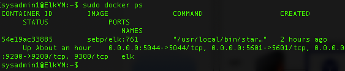

## Automated ELK Stack Deployment

The files in this repository were used to configure the network depicted below.

These files have been tested and used to generate a live ELK deployment on Azure. They can be used to either recreate the entire deployment pictured above. Alternatively, select portions of the .yml files may be used to install only certain pieces of it, such as Filebeat.

  - All ansible playbooks in this repository (install-el.yml, metric-playbook.yml, filebeat-playbook.yml) were all used in the creation and implementation of this ELK stack. 

This document contains the following details:
- Description of the Topology
- Access Policies
- ELK Configuration
  - Beats in Use
  - Machines Being Monitored
- How to Use the Ansible Build

### Description of the Topology

The main purpose of this network is to expose a load-balanced and monitored instance of DVWA, the D*mn Vulnerable Web Application.

Load balancing ensures that the application will be highly redundant, in addition to restricting traffic to the network.
- _Load balancers protect your environment from DDoS attacks by limiting/dispersing traffic, and a jump box grants the admin access to the environment from a single, secured access point.

Integrating an ELK server allows users to easily monitor the vulnerable VMs for changes to the logs and system traffic.
- Filebeat watches for logfiles and locations and collects log events.
- Metricbeat records metric and statistical data from the OS and from services running on the server/machines. 

The configuration details of each machine may be found below.

| Name     | Function | IP Address | Operating System |
|----------|----------|------------|------------------|
| Jump Box | Gateway  | 10.1.0.4   | Linux        |
| Web-1    | Docker   | 10.1.0.5   | Linux            |
| Web-2    | Docker   | 10.1.0.6   | Linux            |
| Web-3    | Docker   | 10.1.0.7   | Linux            |

### Access Policies

The machines on the internal network are not exposed to the public Internet. 

Only the jumpbox machine can accept connections from the Internet. Access to this machine is only allowed from the following IP addresses:
- 98.240.11.95

Machines within the network can only be accessed by SSH.
- The jumpbox container (using it's private IP of 10.1.0.4) is the only machine able to access the ELK VM via SSH. For Kibana, the public IP of 98.240.11.95 can access it as well.

A summary of the access policies in place can be found in the table below.

| Name     | Publicly Accessible | Allowed IP              |
|----------|---------------------|-------------------------|
| Jump Box | No                  | 98.240.11.95            |
| Web-1    | No                  | 10.1.0.4                |
| Web-2    | No                  | 10.1.0.4                |
| Web-3    | No                  | 10.1.0.4                |
| ELK      | No                  | 10.1.0.4 & 98.240.11.95 |

### Elk Configuration

Ansible was used to automate configuration of the ELK machine. No configuration was performed manually, which is advantageous because...
- Automating configuration of virtual machines and containers allows the administrator to rapidly deploy and expand the network as needed.

The playbook implements the following tasks:
- Create a new VM, noting the public and private IP, and connect to the Kibana portal.
- Download and configure ELK-docker, add Elk under webservers in the ansible hosts file, and map ports 5601, 9200, 5044 for ELK.
- Launch and expose the configured container

The following screenshot displays the result of running `docker ps` after successfully configuring the ELK instance.

### Target Machines & Beats
This ELK server is configured to monitor the following machines:
- [10.1.0.5, 10.1.0.6, 10.1.0.7]

We have installed the following Beats on these machines:
- Filebeat and Metricbeat

These Beats allow us to collect the following information from each machine:
- Filebeat monitors logs, collects log events and forwards them to logstash or elasticsearch. Metricbeat collects OS metrics and service metrics and compiles them in a file for you to review. 

### Using the Playbook
In order to use the playbook, you will need to have an Ansible control node already configured. Assuming you have such a control node provisioned: 

SSH into the control node and follow the steps below:
- Copy the filebeat_playbook.yml and metricbeat_playbook.yml files to ~/etc/ansible/roles/.
- Update the hosts file to include the private IP of the ELK VM
- Run the playbook, and navigate to [Kibana](http://52.249.192.182:5601/app/kibana#/home) to check that the installation worked as expected.

_As a **Bonus**, provide the specific commands the user will need to run to download the playbook, update the files, etc._
- ssh -i ~/etc/ansible/id_rsa_azure sysadmin@40.78.68.188
- sudo su
- docker container list -a (locates ansible container, use latest)
- docker start  crazy_jepsen (this starts container name)
- docker attach crazy_jepsen (this attaches the container)
- eval $(ssh-agent) && ssh-add /root/newkey (this allows the public key to be used)
- ansible all -m ping (this makes sure ansible is able to connect)
- ansible-playbook /etc/ansible/roles/install-elk.yml (uses the install elk playbook)
- ansible-playbook /etc/ansible/roles/filebeat-playbook.yml (uses the filebeat playbook)
- ansible-playbook /etc/ansible/roles/metric-playbook.yml (uses the metricbeat playbook)
- open a web browser to [Kibana](http://52.249.192.182:5601/app/kibana#/home)
